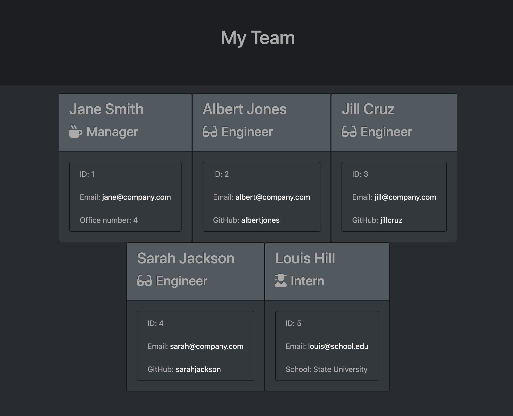

# Team Profile Generator

## Walkthrough Video

[Access the walkthrough video here.](https://youtu.be/dhjKW2Q4JN4)

## Purpose

This team profile generator makes it easy to create a website with your team's basic info so that you have quick access to their emails and GitHub profiles. Use the command line to input your team members' name, role, id, and email, with additional information for certain roles.

## Tech

This application leverages:

* JavaScript
* Node.js
* HTML
* CSS
* Bootstrap

## Team Profile Page

